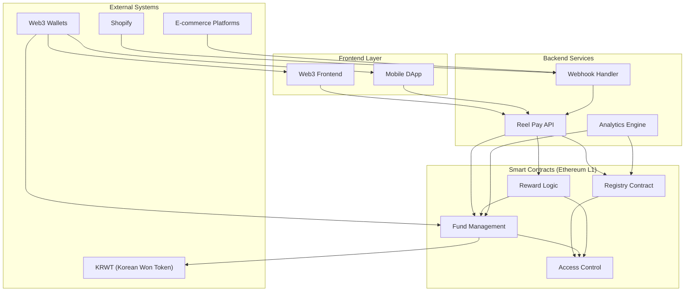
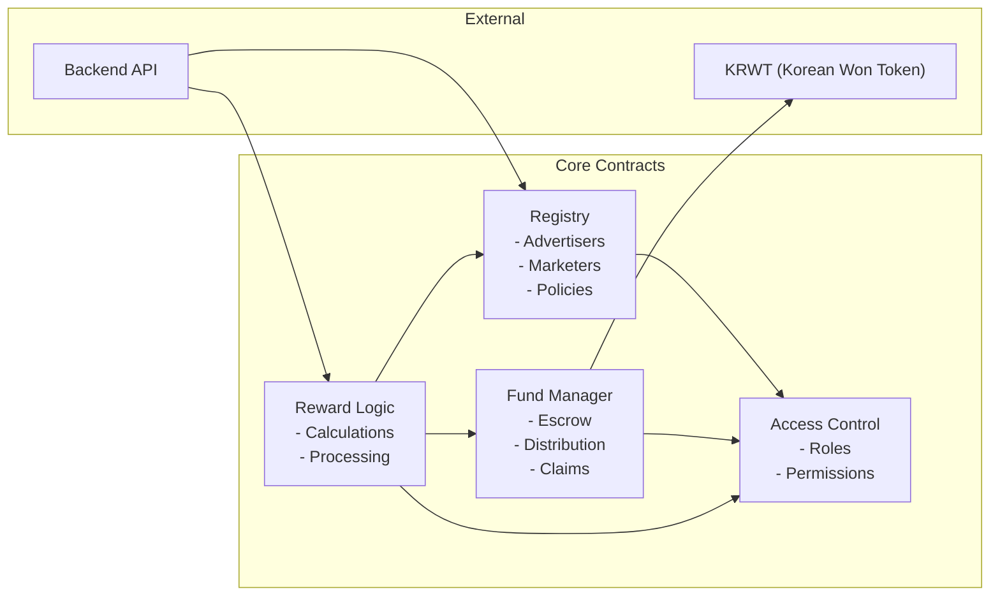
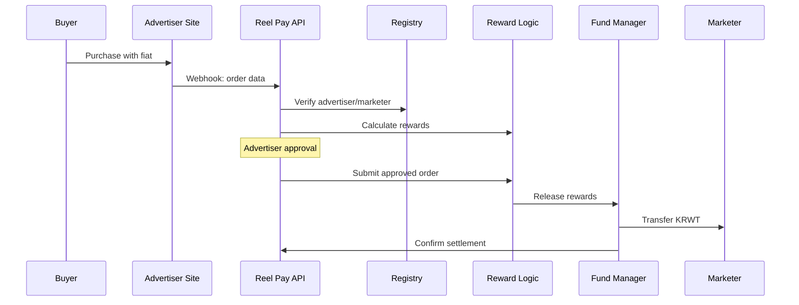
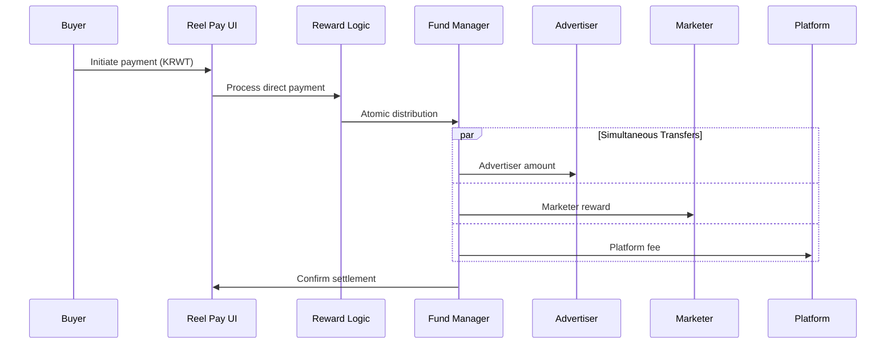
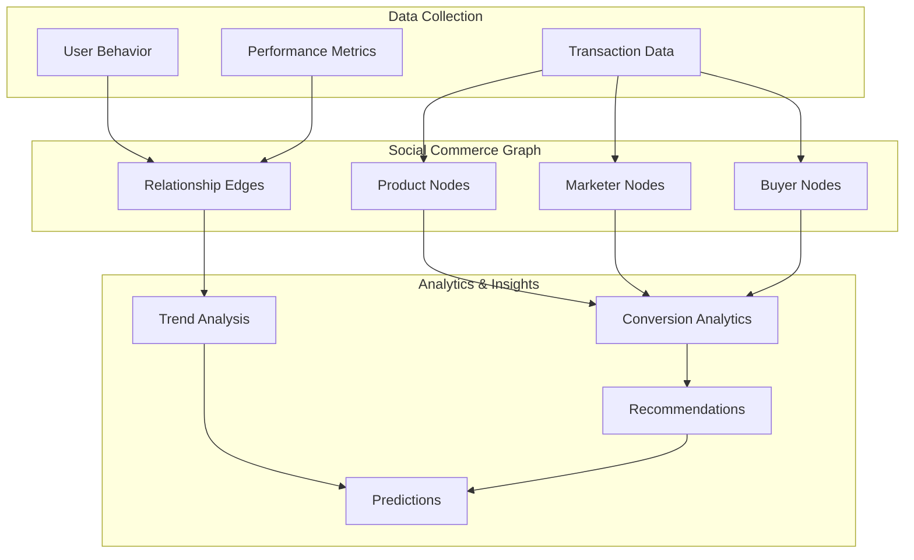

# Reel Pay Smart Contract Architecture

## 개요

Reel Pay는 소셜 커머스와 크리에이터 경제를 위한 Web3 네이티브 금융 프로토콜입니다. 이 문서는 사업 계획서를 기반으로 설계된 스마트 컨트랙트 아키텍처의 청사진을 제시합니다.

## 핵심 비즈니스 요구사항

### 1. 두 가지 운영 모델
- **DPVR (Deferred Payment, Verified Reward)**: 초기 시장 진입 모델
  - 소비자는 기존 결제 시스템(신용카드)으로 구매
  - 광고주 승인 후 마케터에게 스테이블코인으로 보상 지급
- **PVR (Payment, Verification & Reward)**: 성숙 단계 모델
  - 소비자가 스테이블코인으로 직접 결제
  - 원자적 거래로 광고주/마케터/플랫폼에 즉시 분배

### 2. 핵심 참여자
- **광고주 (Advertisers)**: 제품 판매, 보상 정책 설정
- **마케터 (Marketers)**: 제품 추천, 보상 수령
- **소비자 (Buyers)**: 제품 구매
- **플랫폼 (Reel Pay)**: 프로토콜 운영, 수수료 수취

### 3. 주요 기능 요구사항
- 투명하고 자동화된 보상 분배
- 즉시 정산 (기존 Net 60-90일 → 실시간)
- 최소 지급액 제한 없음
- 사기 방지 및 보안
- 확장 가능한 아키텍처

## 스마트 컨트랙트 아키텍처

### 1. Registry Contract (레지스트리 컨트랙트)
**목적**: 시스템 참여자와 정책의 중앙 등록소

```solidity
contract ReelPayRegistry {
    // 광고주 정보
    struct Advertiser {
        address wallet;
        string name;
        bool isActive;
        uint256 defaultCommissionRate; // basis points (100 = 1%)
        uint256 minOrderAmount;
        uint256 createdAt;
    }

    // 마케터 정보
    struct Marketer {
        address wallet;
        string handle;
        bool isActive;
        uint256 totalEarned;
        uint256 createdAt;
    }

    // 제품별 커미션 정책
    struct CommissionPolicy {
        uint256 marketerRate;    // basis points
        uint256 platformRate;   // basis points
        bool isActive;
    }

    mapping(address => Advertiser) public advertisers;
    mapping(address => Marketer) public marketers;
    mapping(bytes32 => CommissionPolicy) public policies; // productId => policy

    // 이벤트
    event AdvertiserRegistered(address indexed advertiser, string name);
    event MarketerRegistered(address indexed marketer, string handle);
    event PolicyUpdated(bytes32 indexed productId, uint256 marketerRate, uint256 platformRate);
}
```

### 2. Fund Management Contract (자금 관리 컨트랙트)
**목적**: DPVR 모델의 에스크로 및 PVR 모델의 자금 분배

```solidity
contract ReelPayFundManager {
    using SafeERC20 for IERC20;

    IERC20 public immutable stablecoin; // KRWT (Korean Won Token)
    IReelPayRegistry public immutable registry;

    // 에스크로 잔액 (DPVR용)
    mapping(address => uint256) public escrowBalances;

    // 클레임 가능한 보상 (Pull 패턴)
    mapping(address => uint256) public claimableRewards;

    // 거래 기록
    struct Transaction {
        bytes32 orderId;
        address advertiser;
        address marketer;
        address buyer;
        uint256 orderAmount;
        uint256 marketerReward;
        uint256 platformFee;
        uint256 timestamp;
        bool isSettled;
    }

    mapping(bytes32 => Transaction) public transactions;

    // DPVR: 광고주가 보상 자금 예치
    function depositEscrow(uint256 amount) external {
        require(registry.advertisers(msg.sender).isActive, "Not registered advertiser");
        stablecoin.safeTransferFrom(msg.sender, address(this), amount);
        escrowBalances[msg.sender] += amount;
        emit EscrowDeposited(msg.sender, amount);
    }

    // DPVR: 승인된 거래의 보상 해제
    function releaseReward(bytes32 orderId, uint256 marketerReward, uint256 platformFee) external {
        Transaction storage txn = transactions[orderId];
        require(txn.advertiser == msg.sender, "Unauthorized");
        require(!txn.isSettled, "Already settled");
        require(escrowBalances[msg.sender] >= marketerReward + platformFee, "Insufficient escrow");

        escrowBalances[msg.sender] -= (marketerReward + platformFee);
        claimableRewards[txn.marketer] += marketerReward;
        claimableRewards[registry.platformWallet()] += platformFee;

        txn.isSettled = true;
        emit RewardReleased(orderId, txn.marketer, marketerReward, platformFee);
    }

    // PVR: 원자적 결제 및 분배
    function payAndDistribute(
        bytes32 orderId,
        address advertiser,
        address marketer,
        uint256 totalAmount,
        uint256 marketerReward,
        uint256 platformFee
    ) external {
        uint256 advertiserAmount = totalAmount - marketerReward - platformFee;

        stablecoin.safeTransferFrom(msg.sender, advertiser, advertiserAmount);
        stablecoin.safeTransferFrom(msg.sender, marketer, marketerReward);
        stablecoin.safeTransferFrom(msg.sender, registry.platformWallet(), platformFee);

        transactions[orderId] = Transaction({
            orderId: orderId,
            advertiser: advertiser,
            marketer: marketer,
            buyer: msg.sender,
            orderAmount: totalAmount,
            marketerReward: marketerReward,
            platformFee: platformFee,
            timestamp: block.timestamp,
            isSettled: true
        });

        emit PaymentDistributed(orderId, advertiser, marketer, totalAmount, marketerReward, platformFee);
    }

    // 보상 클레임 (Pull 패턴)
    function claimRewards() external {
        uint256 amount = claimableRewards[msg.sender];
        require(amount > 0, "No rewards to claim");

        claimableRewards[msg.sender] = 0;
        stablecoin.safeTransfer(msg.sender, amount);
        emit RewardsClaimed(msg.sender, amount);
    }
}
```

### 3. Reward Logic Contract (보상 로직 컨트랙트)
**목적**: 보상 계산 및 분배 로직의 중앙화

```solidity
contract ReelPayRewardLogic {
    IReelPayRegistry public immutable registry;
    IReelPayFundManager public immutable fundManager;

    // 보상 계산
    function calculateRewards(
        bytes32 productId,
        uint256 orderAmount
    ) public view returns (uint256 marketerReward, uint256 platformFee) {
        IReelPayRegistry.CommissionPolicy memory policy = registry.policies(productId);
        require(policy.isActive, "Invalid product policy");

        marketerReward = (orderAmount * policy.marketerRate) / 10000;
        platformFee = (orderAmount * policy.platformRate) / 10000;
    }

    // DPVR: 오프체인에서 승인된 주문 처리
    function submitApprovedOrder(
        bytes32 orderId,
        bytes32 productId,
        address advertiser,
        address marketer,
        uint256 orderAmount
    ) external onlyBackend {
        require(registry.advertisers(advertiser).isActive, "Invalid advertiser");
        require(registry.marketers(marketer).isActive, "Invalid marketer");

        (uint256 marketerReward, uint256 platformFee) = calculateRewards(productId, orderAmount);

        fundManager.releaseReward(orderId, marketerReward, platformFee);

        emit OrderProcessed(orderId, advertiser, marketer, orderAmount, marketerReward, platformFee);
    }

    // PVR: 직접 결제 및 분배
    function processDirectPayment(
        bytes32 orderId,
        bytes32 productId,
        address advertiser,
        address marketer,
        uint256 orderAmount
    ) external {
        require(registry.advertisers(advertiser).isActive, "Invalid advertiser");
        require(registry.marketers(marketer).isActive, "Invalid marketer");

        (uint256 marketerReward, uint256 platformFee) = calculateRewards(productId, orderAmount);

        fundManager.payAndDistribute(
            orderId,
            advertiser,
            marketer,
            orderAmount,
            marketerReward,
            platformFee
        );

        emit DirectPaymentProcessed(orderId, advertiser, marketer, orderAmount, marketerReward, platformFee);
    }
}
```

### 4. Access Control Contract (접근 제어 컨트랙트)
**목적**: 권한 관리 및 보안

```solidity
contract ReelPayAccessControl is AccessControl {
    bytes32 public constant ADMIN_ROLE = keccak256("ADMIN_ROLE");
    bytes32 public constant BACKEND_ROLE = keccak256("BACKEND_ROLE");
    bytes32 public constant ADVERTISER_ROLE = keccak256("ADVERTISER_ROLE");

    constructor() {
        _grantRole(DEFAULT_ADMIN_ROLE, msg.sender);
        _grantRole(ADMIN_ROLE, msg.sender);
    }

    modifier onlyAdmin() {
        require(hasRole(ADMIN_ROLE, msg.sender), "Admin only");
        _;
    }

    modifier onlyBackend() {
        require(hasRole(BACKEND_ROLE, msg.sender), "Backend only");
        _;
    }

    modifier onlyAdvertiser() {
        require(hasRole(ADVERTISER_ROLE, msg.sender), "Advertiser only");
        _;
    }
}
```

## 보안 설계 원칙

### 1. Checks-Effects-Interactions 패턴
- 모든 상태 변경을 외부 호출 전에 완료
- 재진입 공격 방지

### 2. Pull over Push 패턴
- 마케터가 직접 보상을 클레임
- 예상치 못한 외부 계약 호출 위험 최소화

### 3. 역할 기반 접근 제어
- 각 기능별 적절한 권한 분리
- 다중 서명 지갑을 통한 관리자 권한 분산

### 4. 업그레이드 가능성
- 프록시 패턴을 통한 로직 업그레이드
- 타임락을 통한 업그레이드 지연

## 가스 최적화 전략

### 1. 배치 처리
- 여러 거래를 하나의 트랜잭션으로 처리
- 가스 비용 절약

### 2. 이벤트 로깅
- 온체인 저장 대신 이벤트 활용
- 오프체인 인덱싱을 통한 데이터 조회

### 3. EVM 호환성
- Ethereum 메인넷 및 EVM 호환 체인 지원
- 표준 ERC-20 토큰 인터페이스 활용

## 데이터 모델

### 소셜 커머스 그래프
프로토콜을 통해 수집되는 데이터:

```typescript
interface SocialCommerceGraph {
  products: {
    id: string;
    advertiser: string;
    category: string;
    price: number;
    conversionRate: number;
  }[];

  marketers: {
    address: string;
    handle: string;
    followers: number;
    engagementRate: number;
    topCategories: string[];
  }[];

  transactions: {
    orderId: string;
    product: string;
    marketer: string;
    buyer: string;
    amount: number;
    timestamp: number;
  }[];

  relationships: {
    marketerProduct: Map<string, number>; // conversion rates
    productBuyer: Map<string, string[]>; // buyer segments
    marketerInfluence: Map<string, number>; // influence scores
  };
}
```


## 결론

## 아키텍처 시각화

### 전체 시스템 아키텍처



### 컨트랙트 상호작용 다이어그램



### DPVR 플로우 다이어그램



### PVR 플로우 다이어그램



### 데이터 플로우 다이어그램



